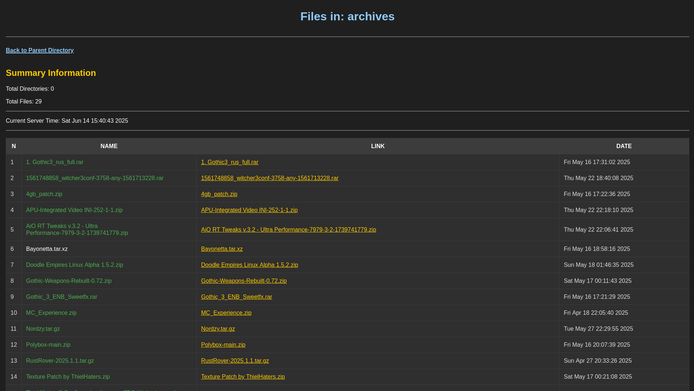

# httpfileserver

This is the httpfileserver C++ project using boost library.



# Simple usage

 + build:

```bash
./build.sh all
```

 + run:

```bash
./build/bin/httpfileserver ~/Downloads 8000 # share ~/Downloads dir in 127.0.0.1:8000
# ./build/bin/httpfileserver <path-to-dir> <port>
```

# Building and installing

See the [BUILDING](BUILDING.md) document.

# Contributing

See the [CONTRIBUTING](CONTRIBUTING.md) document.

# Licensing

<!--
Please go to https://choosealicense.com/licenses/ and choose a license that
fits your needs. The recommended license for a project of this type is the
GNU AGPLv3.
-->
